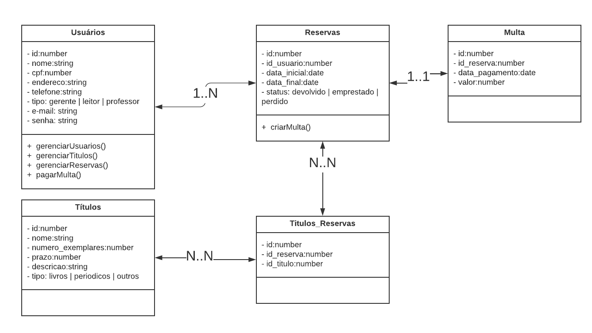

# Sistema de Bibliotecas
O produto da apoio à gestão de uma biblioteca escolar. <br> 
Os títulos da biblioteca podem ser livros, periódicos e outros. Cada título tem um número de exemplares, um período máximo de empréstimo e uma descrição. <br>
Um título só pode ser emprestado a leitores cadastrados, que pagarão multas se ultrapassarem o período de
empréstimo. <br>
Professores cadastrados podem pedir reservas de determinados títulos, para
que sejam consultados apenas na biblioteca durante a oferta de determinada disciplina.<br>
O produto deve permitir o tratamento de perdas e dar apoio ao controle de assinaturas
de periódicos.


## Instalação

Use o pacote de gerenciamento [npm](https://www.npmjs.com/) para instalação.

```bash
npm install
```

## Executar

```bash
npm run start
```

## Testar

```bash
npm run test
```

## Diagrama UML


## License
[MIT](https://choosealicense.com/licenses/mit/)